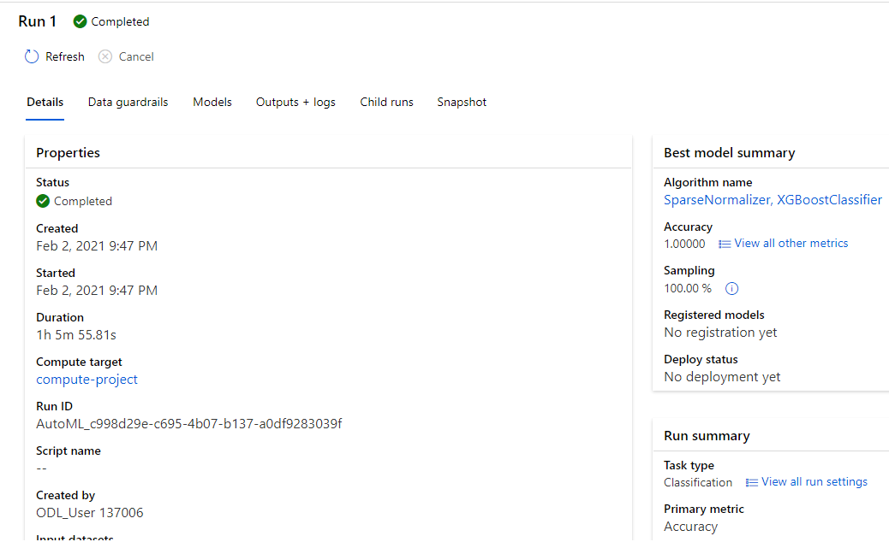
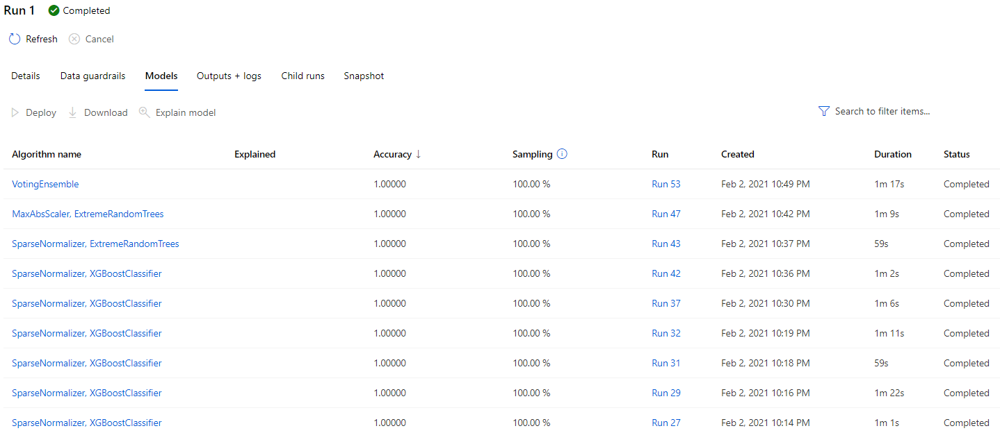
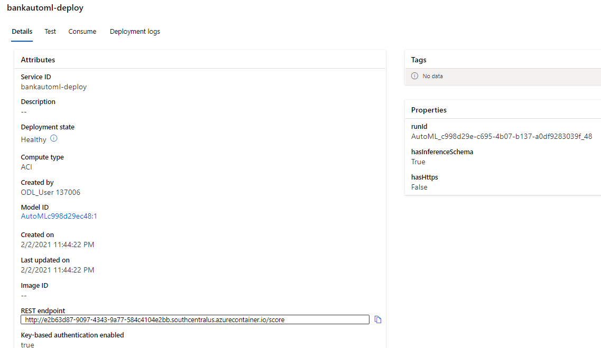

# Operationalizing Machine Learning
In this project we use the Bank Marketing dataset. First, we are using Python SDK and Azure ML Studio to enable authentication, then, we run out automML experiment so we can find the best model and deploy it. Next, we enable logging with aplication insight and after deployment we benchmark the model endpoint and build Swagger documentation for the HTTP API created. Finally, we publish and create the pipeline to automate the model workflow. 

## Architectural Diagram
 

## Key Steps
### 1. AutoML experiment
1. Upload the dataset
 

2. Run autoML experiment 
 

3. Obtain the best model for analysis.
 

### 2. Deploy
 

### 3. Enable Logging
 

## Screen Recording
*TODO* Provide a link to a screen recording of the project in action. Remember that the screencast should demonstrate:

## Standout Suggestions
*TODO (Optional):* This is where you can provide information about any standout suggestions that you have attempted.
