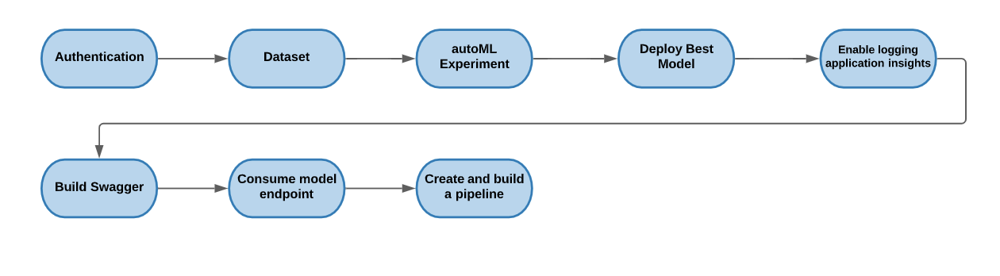
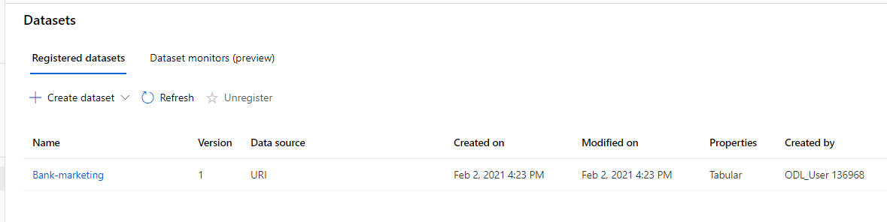
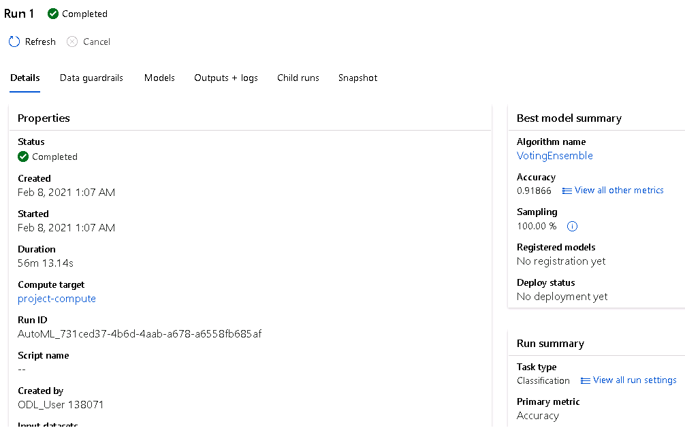
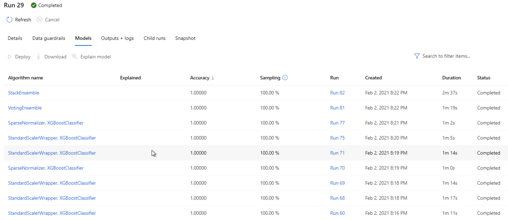
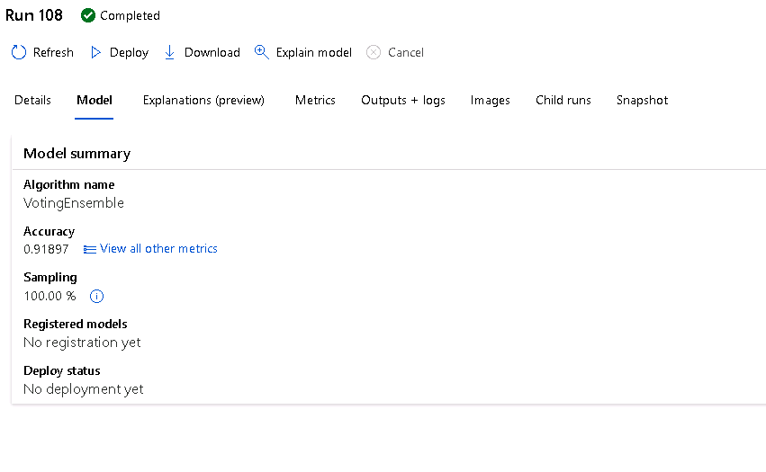
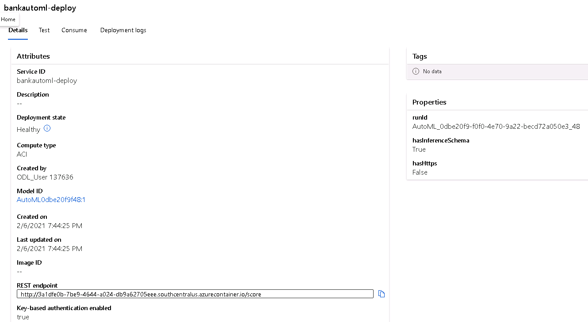
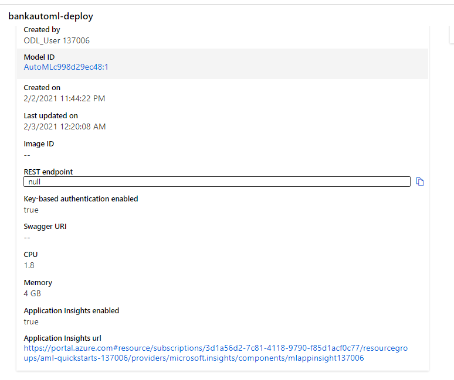
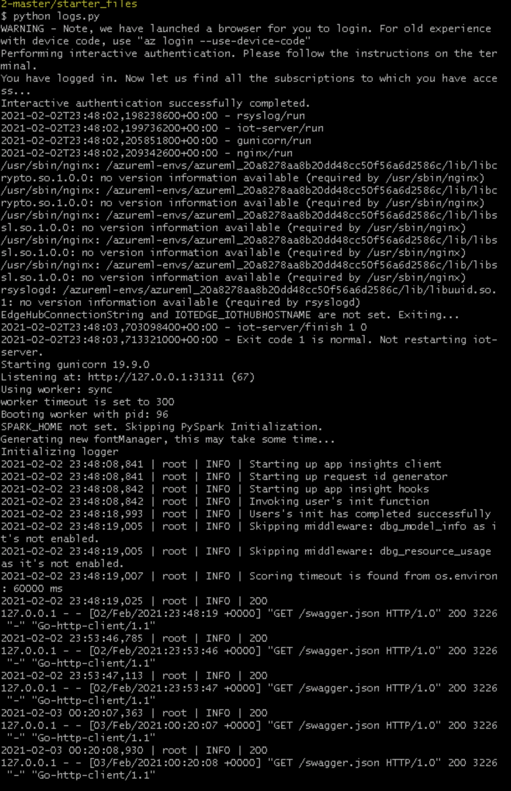
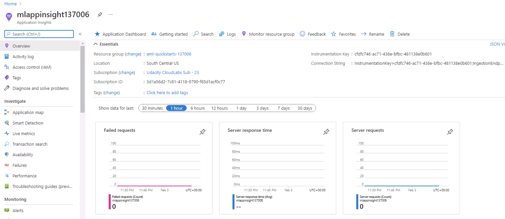

# Operationalizing Machine Learning
In this project we use the Bank Marketing dataset. First, we are using Python SDK and Azure ML Studio to enable authentication. Then, we run out the automML experiment so we can find the best model and deploy it. Next, we enable logging with aplication insights. After deployment, we benchmark the model endpoint and build Swagger documentation for the HTTP API created. Finally, we publish and create the pipeline to automate the model workflow. 

## Architectural Diagram
 

## Table of Contents
- [AutoML experiment](#automl-experiment)
- [Deploy](#deploy)

## Key Steps
### 1. AutoML experiment
1. Upload the dataset
 

2. Run autoML experiment 
 

3. Obtain the best model for analysis.
 

 

### 2. Deploy
 

### 3. Enable Logging Application Insights
In this step, we enabled application insights to monitor the deployed model using Azure Container Instance. In the logs.py, we enable the application insights. We can see that the application was enabled.
 

Then, check the logs.py after running python.py
 

Finally, Application Insights dashboard is displayed.
 

### 4. Build Swagger Documentation
In order for us to use endpoints, we need to use Swagger which runs in the local machine by downloading Docker images and then we run it in port 9000. 

Then, we obtain GET request

Post Request

### 5. Consume Model endpoint

When we enabled authentication when the model was deployed, then it generated keys and REST endpoint url. We use one of the keys to update endpoint.py file.

After that, we benchmark the deployed endpoint.

Last, we run the aml pipelines notebook 

## Screen Recording
*TODO* Provide a link to a screen recording of the project in action. Remember that the screencast should demonstrate:

## Standout Suggestions
*TODO (Optional):* This is where you can provide information about any standout suggestions that you have attempted.
