# Operationalizing Machine Learning
In this project we use the Bank Marketing dataset. First, we are using Python SDK and Azure ML Studio to enable authentication. Then, we run out the automML experiment so we can find the best model and deploy it. Next, we enable logging with aplication insights. After deployment, we benchmark the model endpoint and build Swagger documentation for the HTTP API created. Finally, we publish and create the pipeline to automate the model workflow. 

## Architectural Diagram
 

## Table of Contents
- [Key Steps](#Key-Steps)
  - [AutoML experiment](#AutoML-experiment)
  - [Deploy Best Model](#Deploy-Best-Model)
  - [Enable Logging Application Insights](#Enable-Logging-Application-Insights)
  - [Build Swagger Documentation](#Build-Swagger-Documentation)
  - [Consume Model Endpoint](#Consume-Model-Endpoint)
  - [Create and Build a Pipeline](#Create-and-Build-a-Pipeline)
- [Screen Recording](#Screen-Recording)
- [Standout Suggestions](#Standout-Suggestions)

## Key Steps
### AutoML experiment
1. Upload the dataset
 

2. Run autoML experiment. After 30 minutes, it created the autoML run with the best performing model.
 

3. Obtain the best model for analysis.
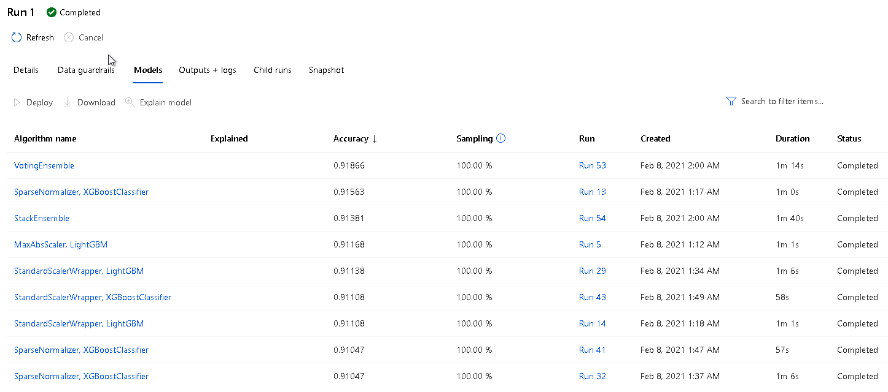 

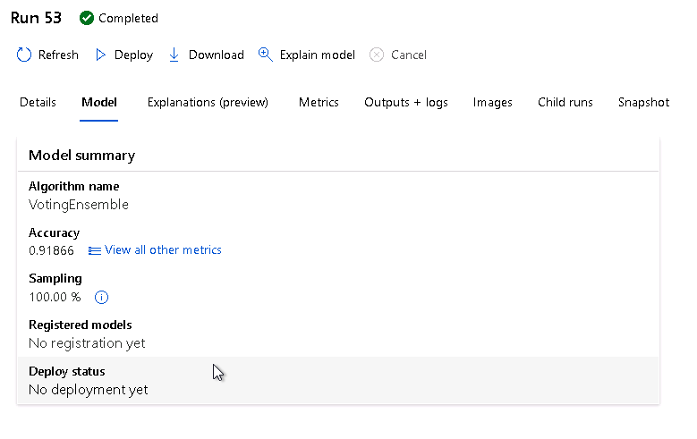 

### Deploy Best Model
Next, we deploy the best model which in this case it's voting Ensemble

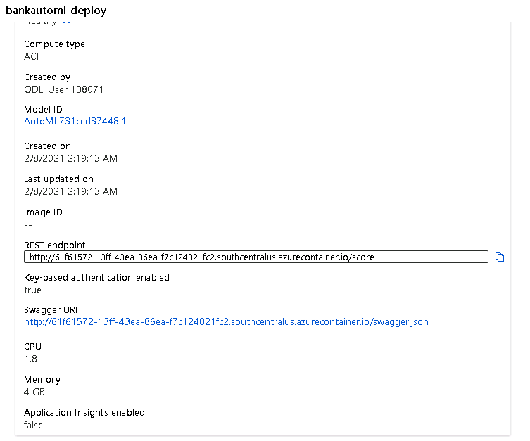 

### Enable Logging Application Insights
In this step, we enabled application insights to monitor the deployed model using Azure Container Instance. In the logs.py, we enable the application insights. We can see that the application was enabled.
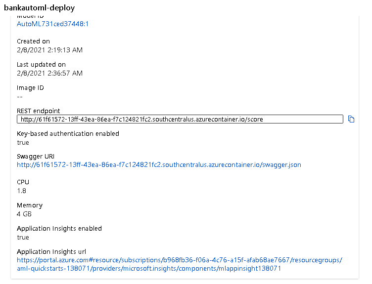 

Then, check the logs.py after running python.py
 

Finally, Application Insights dashboard is displayed.
 

### Build Swagger Documentation
In order for us to use endpoints, we need to use Swagger which runs in the local machine by downloading Docker images and then we run it in port 9000. 

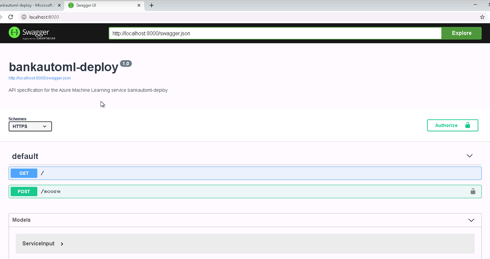

Then, we obtain GET request

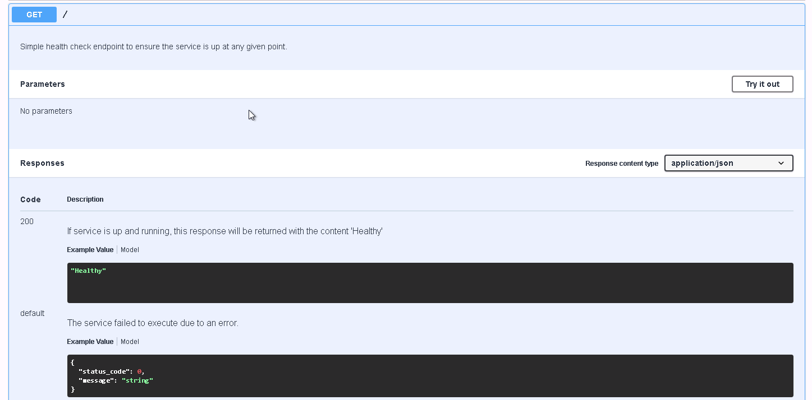

Post Request

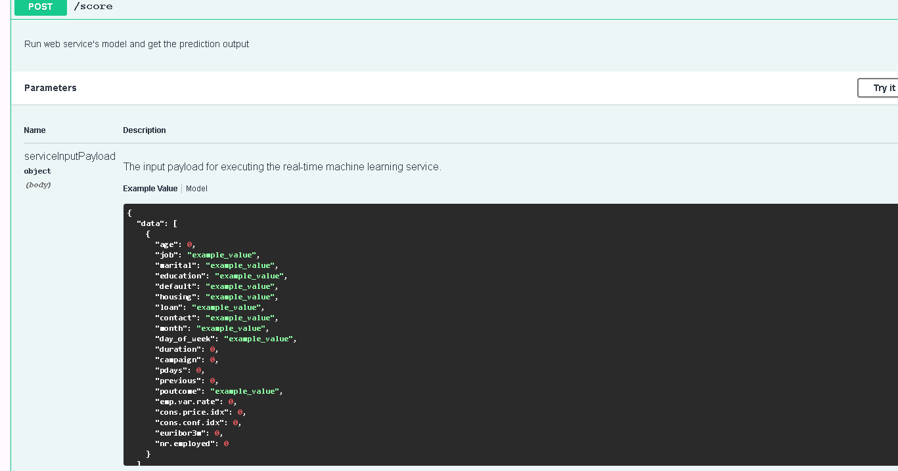

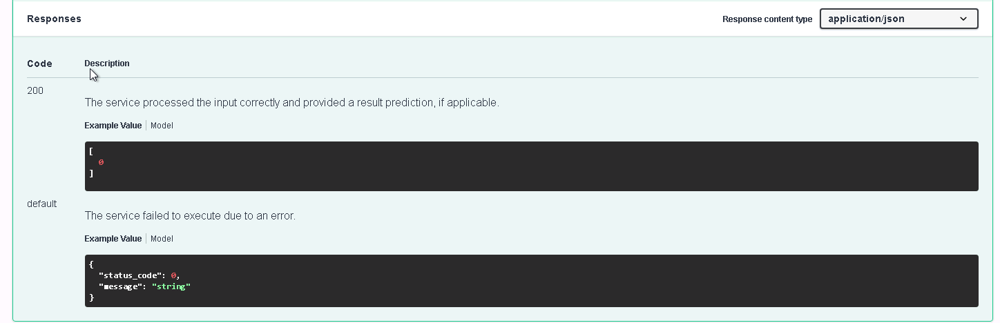

### Consume Model Endpoint

When we enabled authentication when the model was deployed, then it generated keys and REST endpoint url. We use one of the keys to update endpoint.py file.
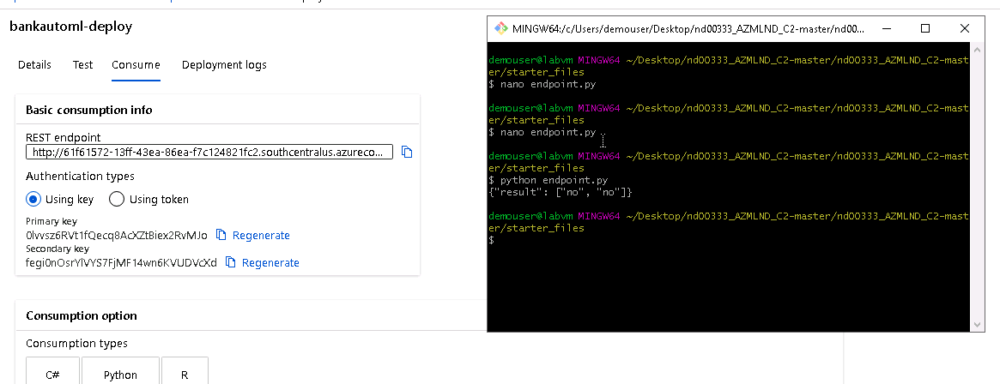

After that, we benchmark the deployed endpoint.
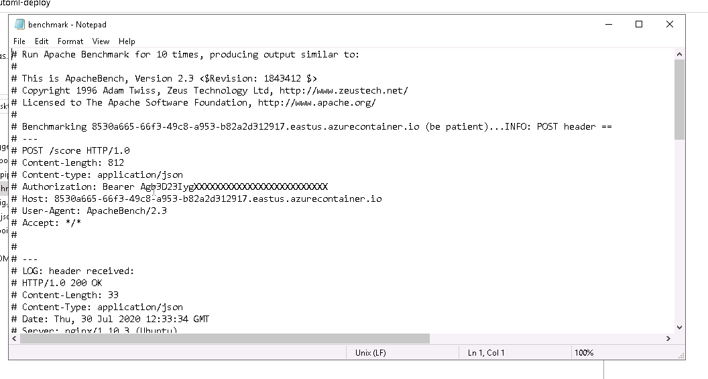

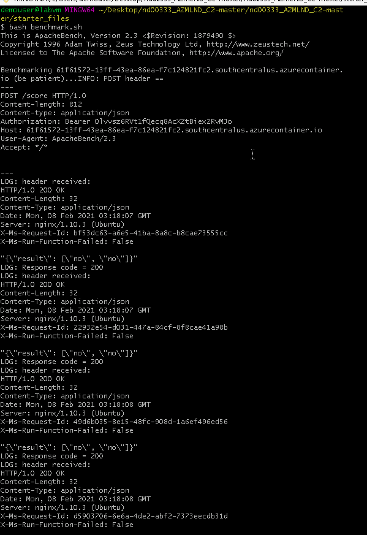
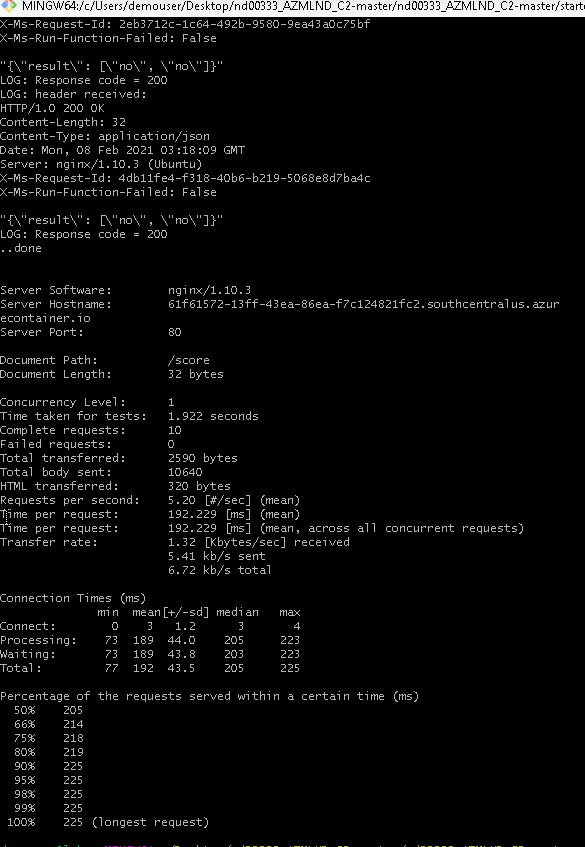

### Create and Build a Pipeline
Last, we run the aml pipelines notbook. In this step, use jupyter notebook to create, publish and consume a pipeline. On the image below, we can see the azureML pipeline was completed.
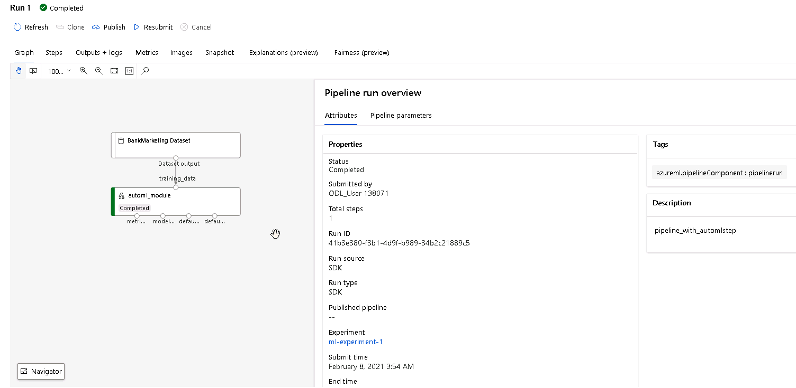

#### Pipeline endpoint
On the endpoints section in Azure studio, we can see details of the pipeline.

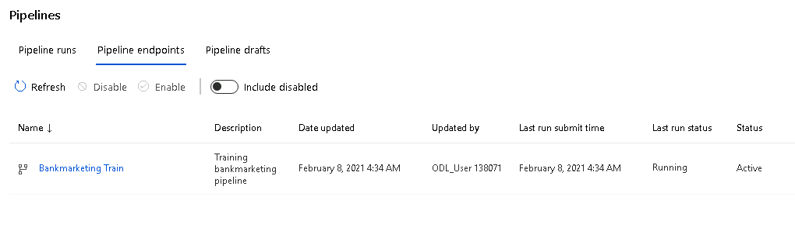

#### Pipeline Run from RunDetails widget in Jupyter Notebook
We can see run widget that gives us information related to the pipeline run. It is one of the way you can track the process of the pipelines from the notebook without having to naviagate to the azure studio.

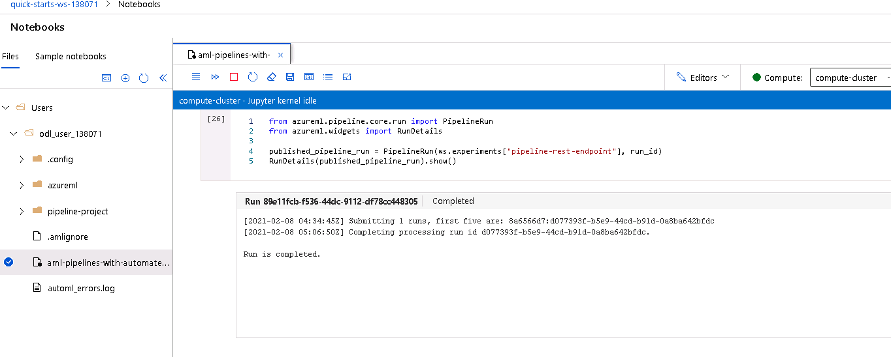

#### Completed Pipeline and Endpoint
The screenshot below shows the details about the completed pipeline including the rest endpoint.

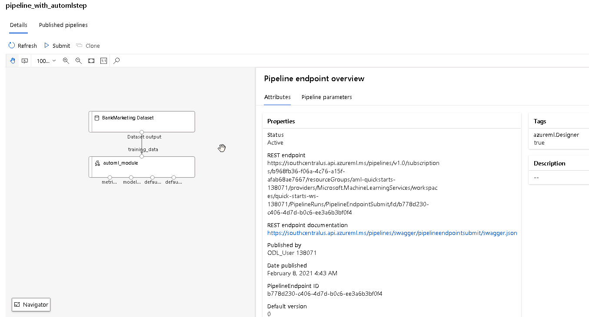

## Screen Recording

Link for screen recording 

## Standout Suggestions
- Since we are dealing with imbalanced dataset, we can try to use methods like under-sampling because it reduces the size of the abundant class and oversampling     
  because it tries to balance dataset by increasing the size of rare samples.
- In order to expedite the training process, we can use a GPU cluster instead of the CPU cluster so the autoML experiment runs faster.
- We could deploy the best model with Azure Kubernetes Service (AKS) for high scalable production deployment.
